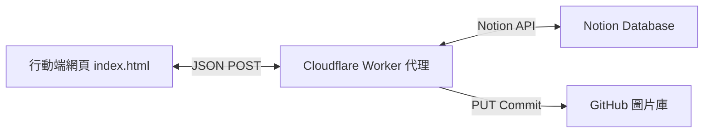

# 🇰🇷 Seoul Buy Log 使用說明書 (User Manual)

歡迎使用 **Seoul Buy Log (韓國連線採購誌)**！本專案是一個專為韓國旅遊/採購設計的 iOS 風格響應式行動端記帳與協同管理網頁。它能透過安全代理 (Cloudflare Worker) 將所有資料即時、雙向同步至您的 **Notion 資料庫**。

---

## 系統架構簡介



1. **前端網頁 (index.html)**：提供高質感的暖奶油系 iOS 卡片介面，包含即時計算、動態地點篩選、發票分組、退稅試算以及拍照上傳功能。
2. **安全代理 (cloudflare-worker.js)**：避免在前端暴露 Notion 密鑰，並處理圖片上傳（自動壓縮至 300KB 以下，依序嘗試上傳至 GitHub、Cloudflare R2、ImgBB 或 Catbox）。
3. **後端資料庫 (Notion)**：所有商品狀態、價格、數量、發票號碼等均永久儲存於您的 Notion 頁面中。

---

## 一、 Notion 資料庫屬性設定

> [!IMPORTANT]
> 為了讓網頁順利讀取與更新，您的 Notion 資料庫必須建立以下屬性欄位。請確保**名稱**與**類型**完全一致：

| 欄位名稱 (Property) | 欄位類型 (Type) | 說明 |
| :--- | :--- | :--- |
| **`Name`** | `Title` (標題) | 商品名稱 |
| **`Category`** | `Select` (單選) | 採購人員（選項須包含或模糊匹配 `依姍`、`梓綺`、`冠曄`） |
| **`Price`** | `Number` (數字) | 韓元單價 (KRW ₩) |
| **`Quantity`** | `Number` (數字) | 購買數量 |
| **`ActualTwd`** | `Number` (數字) | 實際信用卡入帳台幣（選填，填入後以此金額為準，不再以匯率換算） |
| **`TaxRefund`** | `Checkbox` (核取方塊) | 是否退稅 (Tax Free) |
| **`Location`** | `Text` (文字) | 採購地點（支援斜線分組，如 `東大門/鞋街`） |
| **`Description`** | `Text` (文字) | 備註說明（如系列、顏色、尺寸細節） |
| **`InvoiceNo`** | `Text` (文字) | 韓國發票號碼（同一次結帳的商品可填寫相同號碼以防混亂） |
| **`Status`** | `Status` 或 `Select` | 狀態（若包含 `done`、`已`、`完` 代表已買到，其餘代表待採購） |
| **`Image`** | `Files & media` (檔案與媒體) | 商品照片（支援手機拍照即時上傳） |

---

## 二、 前端核心功能說明

### 1. 頂部即時消費看板
- **採購進度**：顯示「已完成購買的**總件數** / 所有商品**總件數**」（以數量 `Quantity` 累加）。
- **已完成消費**：已買到商品的總金額（會**自動扣除退稅**金額），同時顯示韓元及換算後的台幣。
- **未買預算**：剩餘待採購商品的估計總額（使用即時匯率換算台幣）。
- **個人消費統計**：依姍、梓綺、冠曄三位成員各自已買到的台幣與韓元總花費（已自動扣除各自的退稅金額）。
- **已買到可退稅額**：若勾選「是否退稅」且單筆總額達 ₩15,000，會在此顯示預計可退回的總稅額 (7%)。

### 2. 即時匯率設定
- 支援於欄位中自訂目前匯率（預設為 `48`），輸入後全網頁的台幣估算將即時更新。
- 匯率會**自動儲存在瀏覽器的 `localStorage` 中**，重新整理網頁也無需重新輸入。

### 3. 動態地點膠囊篩選列
- 系統會根據目前選取的分頁（全部/依姍/梓綺/冠曄），自動提取當前所有商品的「主要地點」（以斜線 `/` 前的字串為準）。
- 點擊地點膠囊（如 `📍 東大門`）可即時過濾清單，點擊 `📍 全部地點` 可恢復顯示。
- 當切換成員分頁時，地點篩選會自動重設。

### 4. 商品卡片直覺設計
- **待採購優先**：未買到的商品會優先排在最上方（並依地點字母排序），已買到的商品會沉底並顯示綠色打勾標章。
- **快速切換**：點擊卡片右側的圓圈即可即時在 Notion 中切換「待採購 ⏳」與「已買到 ✅」狀態。
- **備註小膠囊**：卡片上會直接以 `💬` 顯示備註內容（設有單行省略，避免卡片過長）。
- **發票號碼**：卡片上會直接顯示 `🧾 發票號碼`，方便對帳。

### 5. 詳情編輯與新增商品
- **地點編輯**：點擊卡片可開啟編輯 Modal，地點欄位已改為輸入框，可直接修改並更新回 Notion。
- **發票管理**：可在編輯與新增時輸入發票號碼，方便將一次結帳的多樣商品綁定在一起。
- **照片上傳**：
  - 新增商品時可點擊相機圖示拍照或選取照片。
  - 前端會自動將照片等比例壓縮並轉換為 JPEG（限制最大寬高 800px，品質 0.7），將大小控制在 **300KB 以下**以加快上傳速度，避免因行動網路不穩導致失敗。

---

## 三、 Cloudflare Worker 代理設定

> [!NOTE]
> 請在 Cloudflare Worker 的控制台 (Settings -> Variables) 中設定以下環境變數，以確保代理伺服器能正常與 Notion 及 GitHub 通訊：

1. **`NOTION_TOKEN`** (必要)：您的 Notion Integration Secret Key。
2. **`DATABASE_ID`** (必要)：Notion 資料庫的 ID（存在於資料庫網址中，為 32 字元的隨機英數字）。
3. **`GITHUB_TOKEN`** (推薦，圖片儲存)：您的 GitHub 個人存取權杖 (Personal Access Token)，用於將上傳的商品圖片直接以 Commit 方式儲存於您的 GitHub 專案庫中（完全免費且無容量限制）。
4. **`GITHUB_OWNER`** (選填)：您的 GitHub 帳號（預設為 `nondiff`）。
5. **`GITHUB_REPO`** (選填)：您的 GitHub 專案庫名稱（預設為 `korea-buy`）。
6. **`GITHUB_BRANCH`** (選填)：預設的分支（預設為 `main`）。

---

## 四、 本地開發與部署說明

### 本地預覽測試
如果您需要在電腦上進行修改與測試，可以使用 Python 快速啟動一個靜態網頁伺服器：
```bash
python -m http.server 8000
```
接著在瀏覽器中打開 `http://localhost:8000/` 即可進行預覽。

### 線上部署 (GitHub Pages)
1. 本專案已託管於 GitHub 儲存庫：`https://github.com/nondiff/korea-buy`。
2. 只要將修改後的 `index.html` 提交並推送到 `main` 分支，GitHub Pages 就會自動完成部署並更新線上網頁。
